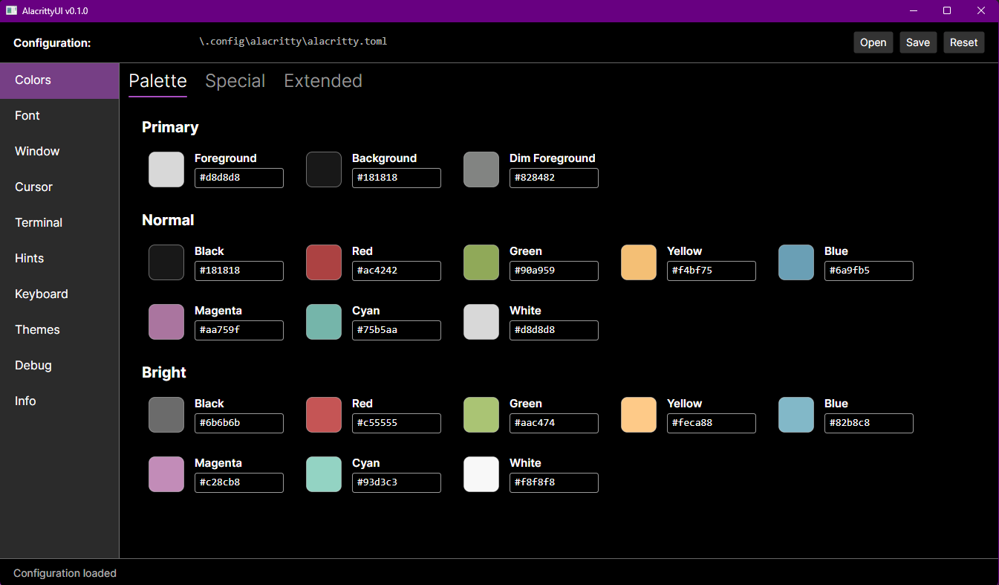

# AlacrittyUI

A cross-platform settings editor for the [Alacritty](https://alacritty.org/) terminal emulator.

Alacritty is fast, minimal, and configurable — but all configuration happens through a TOML file. AlacrittyUI gives you a visual interface to tweak colors, fonts, and settings without memorizing config keys. Changes are written directly to your `alacritty.toml` and apply instantly via Alacritty's live reload.



## What it does

- **Color scheme editor** — pick and preview all 16 terminal colors, plus background, foreground, cursor, and selection colors
- **Theme management** — save your color scheme as a reusable theme, import themes from the [alacritty-themes](https://github.com/alacritty/alacritty-theme) collection, or export your own
- **Live preview** — see how your terminal will look before saving
- **Auto-detection** — finds your `alacritty.toml` automatically on Windows, macOS, and Linux
- **Non-destructive editing** — preserves comments and config sections it doesn't manage

## Requirements

- .NET 10 runtime or later
- Alacritty (any recent version with TOML config support)

## Installation

Download the latest release for your platform from the [Releases](https://github.com/youruser/AlacrittyUI/releases) page.

Or build from source:

```
git clone https://github.com/youruser/AlacrittyUI.git
cd AlacrittyUI
dotnet build src/AlacrittyUI/AlacrittyUI.csproj -c Release
```

## Usage

Launch AlacrittyUI — it will find your Alacritty config automatically. If you keep your config in a non-standard location, use the file picker to point it to the right path.

Edit colors visually, pick a theme, or fine-tune individual settings. Hit save, and Alacritty picks up the changes immediately.

## Built with

- [Avalonia UI](https://avaloniaui.net/) — cross-platform .NET UI framework
- [Tomlyn](https://github.com/xoofx/tomlyn) — TOML parser for .NET
- [CommunityToolkit.Mvvm](https://github.com/CommunityToolkit/dotnet) — MVVM helpers

## Contributing

Contributions are welcome. Please open an issue first to discuss what you'd like to change.

## License

[MIT](LICENSE)
